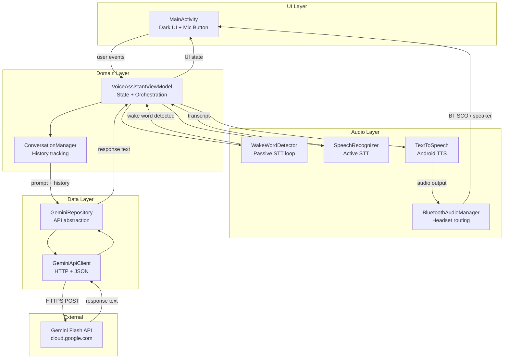
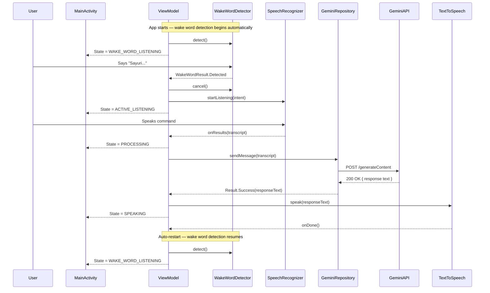
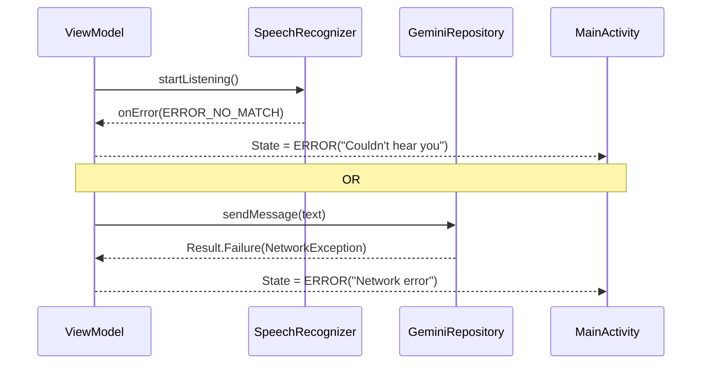
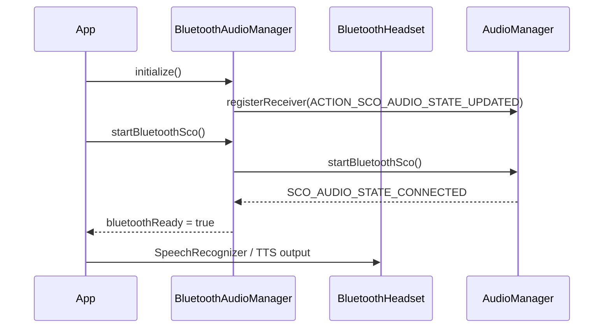

# Design Document: Sayuri Android App

## Overview

Sayuri is a voice-first personal AI assistant Android app that enables hands-free, conversational interaction with Google's Gemini Flash model. The app operates in a two-phase listening model: it passively monitors audio for the wake word "Sayuri", and only after detecting the wake word does it activate full speech recognition, send the transcript to Gemini with a fixed persona system prompt, and read the response aloud — all seamlessly over Bluetooth headsets or the device speaker.

The app is intentionally minimal: a single dark-themed screen with one mic button. The mic button acts as a mute/pause toggle rather than a trigger. All complexity lives in the audio pipeline and API integration, not the UI. The Gemini API key is injected at build time via `BuildConfig` to keep secrets out of source code.

The core interaction loop is: **[Wake word detection] → "Sayuri" detected → Speak → Transcribe → Send → Receive → Speak back → [Resume wake word detection]**.

---

## Architecture



---

## Sequence Diagrams

### Main Interaction Flow



### Error Flow



### Bluetooth Headset Connection Flow



---

## Components and Interfaces

### Component 1: MainActivity

**Purpose**: Single-screen entry point. Renders the dark UI with the mic button and observes ViewModel state.

**Interface**:
```kotlin
class MainActivity : AppCompatActivity() {
    fun onCreate(savedInstanceState: Bundle?)
    fun onRequestPermissionsResult(requestCode: Int, permissions: Array<String>, grantResults: IntArray)
    private fun observeState(viewModel: VoiceAssistantViewModel)
    private fun renderState(state: AssistantState)
}
```

**Responsibilities**:
- Request `RECORD_AUDIO` and `BLUETOOTH_CONNECT` permissions at runtime
- Bind mic button click to `ViewModel.onMicPressed()` as a mute/pause toggle
- Observe `AssistantState` and update button appearance + status text
- Handle back-press / lifecycle cleanup
- Trigger always-on listening start on `onResume` when permissions are granted

---

### Component 2: VoiceAssistantViewModel

**Purpose**: Central orchestrator. Manages the full interaction lifecycle and exposes UI state as `StateFlow`.

**Interface**:
```kotlin
class VoiceAssistantViewModel(
    private val wakeWordDetector: WakeWordDetector,
    private val speechRecognizer: SpeechRecognizerWrapper,
    private val tts: TtsWrapper,
    private val geminiRepository: GeminiRepository,
    private val bluetoothAudioManager: BluetoothAudioManager
) : ViewModel() {

    val state: StateFlow<AssistantState>

    fun onMicPressed()
    fun onDestroy()

    private fun startWakeWordLoop()
    private fun startActiveListening()
    private fun handleTranscript(text: String)
    private fun handleGeminiResponse(text: String)
    private fun handleError(message: String)
}
```

**Responsibilities**:
- Drive state machine: `Idle` → `WakeWordListening` → `ActiveListening` → `Processing` → `Speaking` → `WakeWordListening` (auto-restart)
- Start wake word detection automatically on app foreground when `RECORD_AUDIO` is granted
- Stop WakeWordDetector before starting SpeechRecognizerWrapper (mutual exclusion)
- Auto-restart wake word detection after `Speaking` completes or `Error` is handled
- Propagate errors to UI state without crashing

---

### Component 3: WakeWordDetector

**Purpose**: Passively monitors audio for the wake word "Sayuri" using Android's `SpeechRecognizer` in a lightweight polling loop.

**Interface**:
```kotlin
class WakeWordDetector(private val context: Context) {

    suspend fun detect(): WakeWordResult
    fun cancel()
    fun destroy()
}

sealed class WakeWordResult {
    object Detected : WakeWordResult()
    object NotDetected : WakeWordResult()
    data class Error(val code: Int, val message: String) : WakeWordResult()
}
```

**Responsibilities**:
- Build `RecognizerIntent` with `LANGUAGE_MODEL_FREE_FORM` and a short recognition window
- Bridge `RecognitionListener` callbacks to a `suspendCancellableCoroutine`
- Check all returned result strings for the substring "sayuri" (case-insensitive)
- Return `WakeWordResult.Detected` on match, `WakeWordResult.NotDetected` otherwise
- Return `WakeWordResult.Error` on recognition errors

---

### Component 4: SpeechRecognizerWrapper

**Purpose**: Wraps Android's `SpeechRecognizer` with a callback-to-coroutine bridge.

**Interface**:
```kotlin
class SpeechRecognizerWrapper(private val context: Context) {

    suspend fun listen(): SpeechResult
    fun cancel()
    fun destroy()
}

sealed class SpeechResult {
    data class Success(val transcript: String) : SpeechResult()
    data class Error(val code: Int, val message: String) : SpeechResult()
}
```

**Responsibilities**:
- Build `RecognizerIntent` with `LANGUAGE_MODEL_FREE_FORM` and partial results disabled
- Bridge `RecognitionListener` callbacks to a `suspendCancellableCoroutine`
- Return the highest-confidence result from `onResults`

---

### Component 4: TtsWrapper

**Purpose**: Wraps Android's `TextToSpeech` with coroutine support and Bluetooth audio routing.

**Interface**:
```kotlin
class TtsWrapper(private val context: Context) {

    suspend fun initialize(): Boolean
    suspend fun speak(text: String): TtsResult
    fun stop()
    fun shutdown()
}

sealed class TtsResult {
    object Done : TtsResult()
    data class Error(val message: String) : TtsResult()
}
```

**Responsibilities**:
- Initialize TTS engine and set language to `Locale.US`
- Route audio to Bluetooth SCO when available, otherwise speaker
- Bridge `UtteranceProgressListener.onDone` / `onError` to coroutine

---

### Component 5: GeminiRepository

**Purpose**: Abstracts Gemini API communication. Manages conversation history and injects the system prompt.

**Interface**:
```kotlin
interface GeminiRepository {
    suspend fun sendMessage(userText: String): Result<String>
    fun clearHistory()
}

class GeminiRepositoryImpl(
    private val apiClient: GeminiApiClient,
    private val conversationManager: ConversationManager
) : GeminiRepository {
    override suspend fun sendMessage(userText: String): Result<String>
    override fun clearHistory()
}
```

**Responsibilities**:
- Prepend system prompt to every request
- Append user message to history before sending
- Append assistant response to history on success
- Return `Result.failure` on network or API errors

---

### Component 6: GeminiApiClient

**Purpose**: Low-level HTTP client for the Gemini REST API.

**Interface**:
```kotlin
class GeminiApiClient(private val apiKey: String = BuildConfig.GEMINI_API_KEY) {

    suspend fun generateContent(request: GeminiRequest): GeminiResponse
}
```

**Responsibilities**:
- Construct the correct Gemini Flash endpoint URL
- Serialize `GeminiRequest` to JSON and POST via `OkHttp` + `kotlinx.serialization`
- Deserialize response JSON to `GeminiResponse`
- Throw typed exceptions for HTTP errors (4xx, 5xx)

---

### Component 7: BluetoothAudioManager

**Purpose**: Manages Bluetooth SCO audio connection for headset input/output.

**Interface**:
```kotlin
class BluetoothAudioManager(private val context: Context) {

    val isBluetoothScoAvailable: StateFlow<Boolean>

    fun initialize()
    fun startBluetoothSco()
    fun stopBluetoothSco()
    fun release()
}
```

**Responsibilities**:
- Register `BroadcastReceiver` for `ACTION_SCO_AUDIO_STATE_UPDATED`
- Start/stop SCO connection around listening and speaking phases
- Expose SCO availability as observable state

---

### Component 8: ConversationManager

**Purpose**: Maintains in-memory conversation history for multi-turn context.

**Interface**:
```kotlin
class ConversationManager {

    fun addUserMessage(text: String)
    fun addAssistantMessage(text: String)
    fun getHistory(): List<ConversationTurn>
    fun clear()
}
```

---

## Data Models

### AssistantState

```kotlin
sealed class AssistantState {
    object Idle : AssistantState()
    object WakeWordListening : AssistantState()
    object ActiveListening : AssistantState()
    object Processing : AssistantState()
    data class Speaking(val text: String) : AssistantState()
    data class Error(val message: String) : AssistantState()
}
```

### ConversationTurn

```kotlin
data class ConversationTurn(
    val role: Role,
    val text: String
)

enum class Role { USER, ASSISTANT }
```

### GeminiRequest

```kotlin
@Serializable
data class GeminiRequest(
    val contents: List<GeminiContent>,
    val systemInstruction: GeminiSystemInstruction? = null,
    val generationConfig: GenerationConfig? = null
)

@Serializable
data class GeminiContent(
    val role: String,   // "user" or "model"
    val parts: List<GeminiPart>
)

@Serializable
data class GeminiPart(val text: String)

@Serializable
data class GeminiSystemInstruction(val parts: List<GeminiPart>)

@Serializable
data class GenerationConfig(
    val maxOutputTokens: Int = 256,
    val temperature: Float = 0.9f
)
```

**Validation Rules**:
- `contents` must be non-empty
- Roles must alternate: user → model → user → ...
- `text` in each part must be non-blank

### GeminiResponse

```kotlin
@Serializable
data class GeminiResponse(
    val candidates: List<GeminiCandidate>
)

@Serializable
data class GeminiCandidate(
    val content: GeminiContent,
    val finishReason: String
)
```

---

## Key Functions with Formal Specifications

### VoiceAssistantViewModel.onMicPressed()

```kotlin
fun onMicPressed()
```

**Preconditions:**
- `RECORD_AUDIO` permission is granted
- Current state is `Idle` or `Error`

**Postconditions:**
- State transitions to `Listening`
- `SpeechRecognizer.startListening()` is called exactly once
- If state is `Speaking`, TTS is stopped before listening begins

**Loop Invariants:** N/A

---

### VoiceAssistantViewModel.handleTranscript()

```kotlin
private suspend fun handleTranscript(text: String)
```

**Preconditions:**
- `text` is non-blank
- Current state is `Listening`

**Postconditions:**
- State transitions to `Processing`
- `GeminiRepository.sendMessage(text)` is called with the transcript
- On success: state transitions to `Speaking`, TTS is invoked
- On failure: state transitions to `Error` with a user-friendly message

---

### GeminiRepositoryImpl.sendMessage()

```kotlin
override suspend fun sendMessage(userText: String): Result<String>
```

**Preconditions:**
- `userText` is non-blank
- `apiClient` is initialized with a valid API key

**Postconditions:**
- `userText` is appended to conversation history before the API call
- On `Result.success`: response text is appended to history as `ASSISTANT` role
- On `Result.failure`: history is NOT modified (user message is rolled back)
- Returns `Result.failure(IOException)` on network errors
- Returns `Result.failure(ApiException)` on HTTP 4xx/5xx

---

### SpeechRecognizerWrapper.listen()

```kotlin
suspend fun listen(): SpeechResult
```

**Preconditions:**
- `RECORD_AUDIO` permission is granted
- No active listening session is in progress

**Postconditions:**
- Returns `SpeechResult.Success` with the highest-confidence transcript
- Returns `SpeechResult.Error` if recognition fails or times out
- Coroutine is cancellable: cancellation calls `recognizer.cancel()`

---

### TtsWrapper.speak()

```kotlin
suspend fun speak(text: String): TtsResult
```

**Preconditions:**
- TTS engine is initialized (`initialize()` returned `true`)
- `text` is non-blank

**Postconditions:**
- Audio is routed to Bluetooth SCO if available, otherwise speaker
- Returns `TtsResult.Done` when utterance completes
- Returns `TtsResult.Error` if TTS engine reports failure
- Coroutine is cancellable: cancellation calls `tts.stop()`

---

## Algorithmic Pseudocode

### Main Interaction State Machine

```pascal
ALGORITHM startWakeWordLoop()
INPUT: none
OUTPUT: void (side effects: state transitions, audio I/O, auto-restart loop)

BEGIN
  LOOP FOREVER
    setState(WakeWordListening)

    wakeResult ← AWAIT wakeWordDetector.detect()

    MATCH wakeResult WITH
      | WakeWordResult.Detected →
          wakeWordDetector.cancel()
          AWAIT startActiveListening()
          // After speaking completes, outer loop restarts → back to WakeWordListening
      | WakeWordResult.NotDetected →
          // Loop immediately restarts → back to WakeWordListening
      | WakeWordResult.Error(code, message) →
          setState(Error(mapSpeechError(code)))
          WAIT recoveryDelay (≤ 1000ms)
          // Loop restarts → back to WakeWordListening
    END MATCH
  END LOOP
END

ALGORITHM startActiveListening()
INPUT: none
OUTPUT: void

BEGIN
  bluetoothAudioManager.startBluetoothSco()
  setState(ActiveListening)

  result ← AWAIT speechRecognizer.listen()

  MATCH result WITH
    | SpeechResult.Success(transcript) →
        cleanTranscript ← stripWakeWordPrefix(transcript)
        IF cleanTranscript IS BLANK THEN
          RETURN  // only wake word spoken — return to outer loop
        END IF
        setState(Processing)
        AWAIT handleTranscript(cleanTranscript)
        // After speaking completes, returns here → outer loop resumes
    | SpeechResult.Error(code, message) →
        setState(Error(mapSpeechError(code)))
        WAIT recoveryDelay (≤ 1000ms)
  END MATCH
END

ALGORITHM handleMicPress(currentState)
INPUT: currentState of type AssistantState
OUTPUT: void (side effects: pause or resume listening pipeline)

BEGIN
  IF currentState IS Speaking THEN
    tts.stop()
    setState(Idle)  // muted — loop paused
    listeningJob.cancel()
    RETURN
  END IF

  IF currentState IS WakeWordListening OR ActiveListening THEN
    wakeWordDetector.cancel()
    speechRecognizer.cancel()
    setState(Idle)  // muted — loop paused
    listeningJob.cancel()
    RETURN
  END IF

  IF currentState IS Idle THEN
    // Resume — restart wake word loop
    startWakeWordLoop()
    RETURN
  END IF

  IF currentState IS Processing THEN
    RETURN  // ignore press during Processing
  END IF
END
```

---

### Gemini Request Construction

```pascal
ALGORITHM buildGeminiRequest(userText, history, systemPrompt)
INPUT:
  userText    : String (non-blank)
  history     : List<ConversationTurn>
  systemPrompt: String
OUTPUT: GeminiRequest

BEGIN
  contents ← empty list

  FOR each turn IN history DO
    role ← IF turn.role = USER THEN "user" ELSE "model"
    contents.add(GeminiContent(role, [GeminiPart(turn.text)]))
  END FOR

  contents.add(GeminiContent("user", [GeminiPart(userText)]))

  systemInstruction ← GeminiSystemInstruction([GeminiPart(systemPrompt)])

  RETURN GeminiRequest(
    contents          = contents,
    systemInstruction = systemInstruction,
    generationConfig  = GenerationConfig(maxOutputTokens=256, temperature=0.9)
  )
END
```

**Preconditions:**
- `userText` is non-blank
- `history` alternates USER/ASSISTANT roles (or is empty)

**Postconditions:**
- Last content entry is always role="user"
- `systemInstruction` is always present
- `contents` length = `history.size + 1`

---

### Response Extraction

```pascal
ALGORITHM extractResponseText(geminiResponse)
INPUT: geminiResponse of type GeminiResponse
OUTPUT: Result<String>

BEGIN
  IF geminiResponse.candidates IS EMPTY THEN
    RETURN Failure("No response from Gemini")
  END IF

  candidate ← geminiResponse.candidates[0]

  IF candidate.finishReason = "SAFETY" THEN
    RETURN Failure("Response blocked by safety filter")
  END IF

  IF candidate.content.parts IS EMPTY THEN
    RETURN Failure("Empty response content")
  END IF

  text ← candidate.content.parts[0].text

  IF text IS BLANK THEN
    RETURN Failure("Blank response text")
  END IF

  RETURN Success(text.trim())
END
```

---

### Bluetooth SCO Lifecycle

```pascal
ALGORITHM manageScoForOperation(operation)
INPUT: operation : () → Unit  (the listening or speaking action)
OUTPUT: void

BEGIN
  IF bluetoothAudioManager.isBluetoothScoAvailable THEN
    bluetoothAudioManager.startBluetoothSco()
    WAIT FOR SCO_AUDIO_STATE_CONNECTED (timeout: 3000ms)
  END IF

  AWAIT operation()

  IF bluetoothAudioManager.isBluetoothScoAvailable THEN
    bluetoothAudioManager.stopBluetoothSco()
  END IF
END
```

---

## Example Usage

### Full Interaction (Kotlin coroutine context)

```kotlin
// In VoiceAssistantViewModel
fun startWakeWordLoop() {
    listeningJob = viewModelScope.launch {
        while (isActive) {
            _state.value = AssistantState.WakeWordListening

            when (val wakeResult = wakeWordDetector.detect()) {
                is WakeWordResult.Detected -> {
                    wakeWordDetector.cancel()
                    startActiveListening()
                    // After startActiveListening() returns (SPEAKING done), loop restarts
                }
                is WakeWordResult.NotDetected -> {
                    // Immediately loop back to WakeWordListening
                }
                is WakeWordResult.Error -> {
                    _state.value = AssistantState.Error(
                        mapSpeechErrorCode(wakeResult.code)
                    )
                    delay(RECOVERY_DELAY_MS) // ≤ 1000ms
                }
            }
        }
    }
}

private suspend fun startActiveListening() {
    _state.value = AssistantState.ActiveListening

    when (val result = speechRecognizer.listen()) {
        is SpeechResult.Success -> {
            val clean = result.transcript
                .removePrefix("sayuri")
                .removePrefix("Sayuri")
                .trim()
            if (clean.isBlank()) return  // only wake word spoken
            _state.value = AssistantState.Processing
            handleTranscript(clean)
        }
        is SpeechResult.Error -> {
            _state.value = AssistantState.Error(
                mapSpeechErrorCode(result.code)
            )
            delay(RECOVERY_DELAY_MS)
        }
    }
}

fun onMicPressed() {
    when (_state.value) {
        is AssistantState.WakeWordListening,
        is AssistantState.ActiveListening -> {
            wakeWordDetector.cancel()
            speechRecognizer.cancel()
            _state.value = AssistantState.Idle
            listeningJob?.cancel()
        }
        is AssistantState.Speaking -> {
            tts.stop()
            _state.value = AssistantState.Idle
            listeningJob?.cancel()
        }
        is AssistantState.Idle -> {
            startWakeWordLoop()
        }
        is AssistantState.Processing -> {
            // Ignore
        }
        else -> Unit
    }
}

private suspend fun handleTranscript(text: String) {
    geminiRepository.sendMessage(text)
        .onSuccess { response ->
            _state.value = AssistantState.Speaking(response)
            tts.speak(response)
            // Returns to WakeWordListening via the outer loop
        }
        .onFailure { error ->
            _state.value = AssistantState.Error(
                error.message ?: "Something went wrong"
            )
        }
}
```

### GeminiApiClient HTTP Call

```kotlin
suspend fun generateContent(request: GeminiRequest): GeminiResponse {
    val url = "https://generativelanguage.googleapis.com/v1beta/models/" +
              "gemini-1.5-flash:generateContent?key=$apiKey"

    val body = Json.encodeToString(request)
        .toRequestBody("application/json".toMediaType())

    val httpRequest = Request.Builder()
        .url(url)
        .post(body)
        .build()

    val response = okHttpClient.newCall(httpRequest).await()

    if (!response.isSuccessful) {
        throw ApiException(response.code, response.message)
    }

    return Json.decodeFromString(response.body!!.string())
}
```

### BuildConfig API Key Setup (build.gradle.kts)

```kotlin
android {
    defaultConfig {
        buildConfigField(
            "String",
            "GEMINI_API_KEY",
            "\"${project.findProperty("GEMINI_API_KEY") ?: ""}\""
        )
    }
}
```

```properties
# local.properties (git-ignored)
GEMINI_API_KEY=your_api_key_here
```

---

## Correctness Properties

*A property is a characteristic or behavior that should hold true across all valid executions of a system — essentially, a formal statement about what the system should do. Properties serve as the bridge between human-readable specifications and machine-verifiable correctness guarantees.*

### Property 1: State Machine Completeness

*For any* `AssistantState` value (`Idle`, `Listening`, `Processing`, `Speaking`, `Error`), the state machine produces a defined next state — no state is a dead end and no unhandled state transition exists.

**Validates: Requirements 1.7**

---

### Property 2: Auto-Restart After Terminal State

*For any* terminal interaction outcome (TTS completion or error condition), `VoiceAssistantViewModel` always transitions back to the `LISTENING` state — the always-on listening loop is never permanently broken by a single interaction result.

**Validates: Requirements 1.2, 1.5, 1.6**

---

### Property 3: TTS and STT Mutual Exclusion

*For any* sequence of interaction events, `TtsWrapper` and `SpeechRecognizerWrapper` are never active simultaneously — at no point in time are both the TTS engine speaking and the speech recognizer listening.

**Validates: Requirements 1.8**

---

### Property 4: Transcript Non-Blank Invariant

*For any* recognition result returned by Android's `SpeechRecognizer`, `SpeechRecognizerWrapper` never returns a `SpeechResult.Success` containing a blank or empty transcript string.

**Validates: Requirements 3.3**

---

### Property 5: Highest-Confidence Transcript Selection

*For any* list of recognition results with varying confidence scores, `SpeechRecognizerWrapper` returns the result with the highest confidence score as the transcript in `SpeechResult.Success`.

**Validates: Requirements 3.2**

---

### Property 6: LISTENING to PROCESSING Transition

*For any* non-blank transcript string returned by `SpeechRecognizerWrapper`, `VoiceAssistantViewModel` always transitions the state from `LISTENING` to `PROCESSING` before invoking `GeminiRepository`.

**Validates: Requirements 1.4**

---

### Property 7: System Prompt Always Present

*For any* non-blank user text and any conversation history passed to `GeminiRepository.sendMessage()`, the resulting `GeminiRequest` sent to `GeminiApiClient` always contains the `System_Prompt` as the `systemInstruction` field.

**Validates: Requirements 4.1, 4.2**

---

### Property 8: History Consistency After Success

*For any* successful `GeminiRepository.sendMessage()` call, `conversationManager.getHistory().last().role == ASSISTANT` — the last entry in the history is always the assistant's response.

**Validates: Requirements 4.4**

---

### Property 9: History Rollback After Failure

*For any* failed `GeminiRepository.sendMessage()` call, the conversation history length is unchanged from before the call — the user message appended before the API call is rolled back on failure.

**Validates: Requirements 4.5**

---

### Property 10: GeminiRequest Last Role Invariant

*For any* conversation history (including empty history) and any non-blank user text, the `GeminiRequest` built by `GeminiRepository` always has `"user"` as the role of the last entry in `contents`.

**Validates: Requirements 4.9**

---

### Property 11: API Error Code Propagation

*For any* HTTP status code in the 4xx or 5xx range returned by the Gemini API, `GeminiApiClient` throws an `ApiException` whose `code` field equals the HTTP status code.

**Validates: Requirements 4.6**

---

### Property 12: GeminiRequest Serialization Round-Trip

*For any* valid `GeminiRequest` object, serializing it to JSON using `kotlinx.serialization` and then deserializing the resulting JSON back produces an equivalent `GeminiRequest` object.

**Validates: Requirements 4.8**

---

### Property 13: GeminiResponse Serialization Round-Trip

*For any* valid `GeminiResponse` object, serializing it to JSON using `kotlinx.serialization` and then deserializing the resulting JSON back produces an equivalent `GeminiResponse` object.

**Validates: Requirements 4.8**

---

### Property 14: ConversationManager Role Assignment

*For any* sequence of `addUserMessage()` and `addAssistantMessage()` calls with any string values, every entry added via `addUserMessage()` has `role = USER` and every entry added via `addAssistantMessage()` has `role = ASSISTANT`.

**Validates: Requirements 7.2, 7.3**

---

### Property 15: ConversationManager History Cap

*For any* number of messages added to `ConversationManager` exceeding 10 turns, the history length never exceeds 10 turns — older entries are evicted to enforce the cap.

**Validates: Requirements 7.4, 13.3**

---

### Property 16: ConversationManager Clear Idempotence

*For any* conversation history state (empty or non-empty), calling `ConversationManager.clear()` always results in an empty history list — `getHistory().isEmpty() == true`.

**Validates: Requirements 7.5**

---

### Property 17: Long Text TTS Splitting

*For any* response text exceeding 500 characters, `TtsWrapper` splits the text into multiple chunks on sentence boundaries such that no individual chunk passed to the `TextToSpeech` engine exceeds 500 characters.

**Validates: Requirements 5.6**

---

### Property 18: ViewModel Exception Safety

*For any* exception thrown within a `viewModelScope` coroutine, `VoiceAssistantViewModel` catches the exception and transitions to `AssistantState.Error` without propagating an uncaught exception that would crash the App.

**Validates: Requirements 10.5**

---

## Error Handling

### Error Scenario 1: No Speech Detected

**Condition**: `SpeechRecognizer` returns `ERROR_NO_MATCH` or `ERROR_SPEECH_TIMEOUT`
**Response**: Transition to `AssistantState.Error("Couldn't hear you. Try again.")`
**Recovery**: User presses mic button again; state resets to `Idle` before listening

### Error Scenario 2: Network Failure

**Condition**: `OkHttp` throws `IOException` during Gemini API call
**Response**: `GeminiRepository` returns `Result.failure(IOException)`; ViewModel transitions to `AssistantState.Error("No internet connection")`
**Recovery**: User presses mic button; previous transcript is not retried (user must re-speak)

### Error Scenario 3: Gemini API Error (4xx/5xx)

**Condition**: Gemini returns non-2xx HTTP status
**Response**: `GeminiApiClient` throws `ApiException(code, message)`; ViewModel shows `AssistantState.Error("Service error. Try again.")`
**Recovery**: Same as network failure

### Error Scenario 4: TTS Initialization Failure

**Condition**: `TextToSpeech.OnInitListener` returns `ERROR`
**Response**: `TtsWrapper.initialize()` returns `false`; ViewModel logs warning and shows error state
**Recovery**: App retries TTS initialization on next `onResume`

### Error Scenario 5: Missing Microphone Permission

**Condition**: `RECORD_AUDIO` permission not granted
**Response**: `MainActivity` shows permission rationale dialog; mic button is disabled
**Recovery**: User grants permission; button becomes active

### Error Scenario 6: Bluetooth SCO Timeout

**Condition**: SCO connection does not establish within 3 seconds
**Response**: `BluetoothAudioManager` emits `isBluetoothScoAvailable = false`
**Recovery**: Audio falls back to device speaker/microphone transparently

---

## Testing Strategy

### Unit Testing Approach

Test each component in isolation using JUnit 5 + MockK:

- `VoiceAssistantViewModel`: Mock all dependencies; verify state transitions for each scenario (success, speech error, network error, TTS error)
- `GeminiRepositoryImpl`: Mock `GeminiApiClient`; verify history management, system prompt injection, rollback on failure
- `ConversationManager`: Verify add/clear/history ordering
- `extractResponseText`: Table-driven tests for all response shapes (empty candidates, safety block, blank text, valid text)

### Property-Based Testing Approach

**Property Test Library**: `kotest-property`

Key properties to test:
- `buildGeminiRequest` always produces a request where the last content role is `"user"`, for any non-empty history
- `ConversationManager` history always alternates USER/ASSISTANT roles after any sequence of valid add operations
- `extractResponseText` never returns `Success` with a blank string, for any `GeminiResponse` input

### Integration Testing Approach

- `GeminiApiClient`: Use `MockWebServer` (OkHttp) to simulate Gemini API responses; verify correct URL construction, JSON serialization, and error handling
- End-to-end flow: Use Espresso + a fake `GeminiRepository` to verify the full UI state machine from button press to TTS completion

---

## Performance Considerations

- **Latency budget**: Target < 3 seconds from end of speech to start of TTS playback (network RTT is the dominant factor)
- **Coroutine dispatchers**: `speechRecognizer.listen()` and `tts.speak()` run on `Dispatchers.Main` (Android audio APIs require main thread); `GeminiApiClient` runs on `Dispatchers.IO`
- **History size**: Cap `ConversationManager` history at 10 turns (20 messages) to bound token usage and request size
- **TTS chunking**: For responses > 500 characters, split on sentence boundaries before passing to TTS to reduce time-to-first-audio
- **OkHttp connection pooling**: Reuse a single `OkHttpClient` instance across the app lifetime to avoid TCP handshake overhead

---

## Security Considerations

- **API key storage**: Key lives in `local.properties` (git-ignored) and is injected into `BuildConfig` at compile time. Never logged, never sent in headers — only as a URL query parameter per Gemini API spec.
- **No persistent storage**: Conversation history is in-memory only; no transcripts or responses are written to disk or shared preferences.
- **Network security**: All Gemini API calls use HTTPS. Add a `network_security_config.xml` that disables cleartext traffic.
- **Permission minimization**: Only `RECORD_AUDIO`, `INTERNET`, `BLUETOOTH`, and `BLUETOOTH_CONNECT` (API 31+) permissions are declared. No location, contacts, or storage permissions.
- **Input sanitization**: User transcript is sent as plain text in a JSON string field — `kotlinx.serialization` handles escaping, preventing JSON injection.

---

## Dependencies

| Dependency | Version | Purpose |
|---|---|---|
| `androidx.lifecycle:lifecycle-viewmodel-ktx` | 2.7.x | ViewModel + coroutine scope |
| `org.jetbrains.kotlinx:kotlinx-coroutines-android` | 1.8.x | Coroutine support |
| `org.jetbrains.kotlinx:kotlinx-serialization-json` | 1.6.x | JSON serialization for Gemini API |
| `com.squareup.okhttp3:okhttp` | 4.12.x | HTTP client |
| `com.squareup.okhttp3:mockwebserver` | 4.12.x | Integration test HTTP mocking |
| `io.mockk:mockk` | 1.13.x | Unit test mocking |
| `io.kotest:kotest-runner-junit5` | 5.8.x | Test runner |
| `io.kotest:kotest-property` | 5.8.x | Property-based testing |
| Android `SpeechRecognizer` | built-in | Speech-to-text |
| Android `TextToSpeech` | built-in | Text-to-speech |
| Android `BluetoothAdapter` / `AudioManager` | built-in | Bluetooth SCO audio routing |
